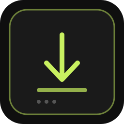

# estrai-articolo

<p align="center">
  
</p>

Applicazione locale per estrarre, ripulire e impaginare il testo di articoli accessibili all'utente, con interfaccia web su `localhost` ed export in formato DOCX.

## Stato progetto

- Repository pubblico
- Release sorgente corrente: `v0.1.0`
- CI minima presente e verde
- Licenza progetto: `GPL-3.0-or-later`
- Packaging `.deb` non previsto in questa fase

## Funzionalita' principali

- Avvio rapido con `./avvia.sh`
- Installazione locale integrata con `./installa.sh`
- Interfaccia web locale disponibile su `http://localhost:7432`
- Estrazione del contenuto testuale da una pagina articolo accessibile all'utente
- Pulizia del testo e visualizzazione dei metadati principali quando disponibili
- Azioni rapide nell'interfaccia: copia testo, salvataggio `.txt`, stampa, export `.docx`

## Requisiti

- Linux con `bash`
- Python `>= 3.10`
- `python3-venv` per l'installazione integrata o per l'ambiente di sviluppo
- Browser web locale
- Dipendenza Python: `python-docx`

## Installazione integrata

Per installare il progetto in `/opt/estrai-articolo` con virtual environment dedicato:

```bash
./installa.sh
```

Lo script:

- copia i file applicativi in `/opt/estrai-articolo`
- crea la virtualenv in `/opt/estrai-articolo/venv`
- installa le dipendenze da `requirements.txt`
- crea la voce desktop locale per l'utente corrente

## Avvio manuale e sviluppo

Per un uso locale senza installazione di sistema:

```bash
python3 -m venv .venv
source .venv/bin/activate
pip install -r requirements.txt
python3 server.py
```

In alternativa, dopo aver preparato l'ambiente:

```bash
source .venv/bin/activate
./avvia.sh
```

`avvia.sh` usa la virtualenv locale `venv/` se presente; in assenza di quella directory prova con `python3` di sistema, che puo' essere anche quello della `.venv` gia' attivata nella shell corrente.

## Uso base

1. Avvia l'applicazione con `./avvia.sh`.
2. Apri `http://localhost:7432` se il browser non si apre automaticamente.
3. Inserisci l'URL di una pagina articolo accessibile all'utente.
4. Avvia l'estrazione e verifica titolo, testata, data, autore e testo risultante.
5. Se necessario, esporta in `.docx` oppure salva il testo in `.txt`.

Per istruzioni operative piu' dettagliate: [docs/USO.md](docs/USO.md).

## Struttura progetto

- `server.py`: server HTTP locale ed export DOCX
- `gui.html`: interfaccia web locale
- `avvia.sh`: avvio rapido del server e apertura del browser
- `installa.sh`: installazione locale in `/opt/estrai-articolo`
- `requirements.txt`: dipendenze Python runtime
- `pyproject.toml`: metadati del progetto
- `assets/`: logo e icone
- `packaging/`: file desktop
- `docs/`: documentazione operativa e di manutenzione

## Licenza

Questo progetto e' distribuito con licenza [GPL-3.0-or-later](LICENSE).

## Dipendenze terze

Il progetto usa dipendenze che mantengono le rispettive licenze. Dettagli in [THIRD_PARTY_LICENSES.md](THIRD_PARTY_LICENSES.md).

## Disclaimer

Il software e' fornito "as is", senza garanzie. L'utente resta responsabile dell'uso del programma, della verifica dei contenuti elaborati e del rispetto di termini d'uso, diritti applicabili e policy delle fonti consultate.

## Marchio GD LEX

I riferimenti nominativi e grafici a STUDIO GD LEX / GD LEX non sono concessi dalla licenza GPL del progetto. Ogni uso del marchio resta riservato ai rispettivi titolari salvo autorizzazione separata.

## Altra documentazione

- [docs/USO.md](docs/USO.md)
- [docs/BUILD.md](docs/BUILD.md)
- [docs/RELEASE.md](docs/RELEASE.md)
- [docs/TROUBLESHOOTING.md](docs/TROUBLESHOOTING.md)
- [CHANGELOG.md](CHANGELOG.md)
